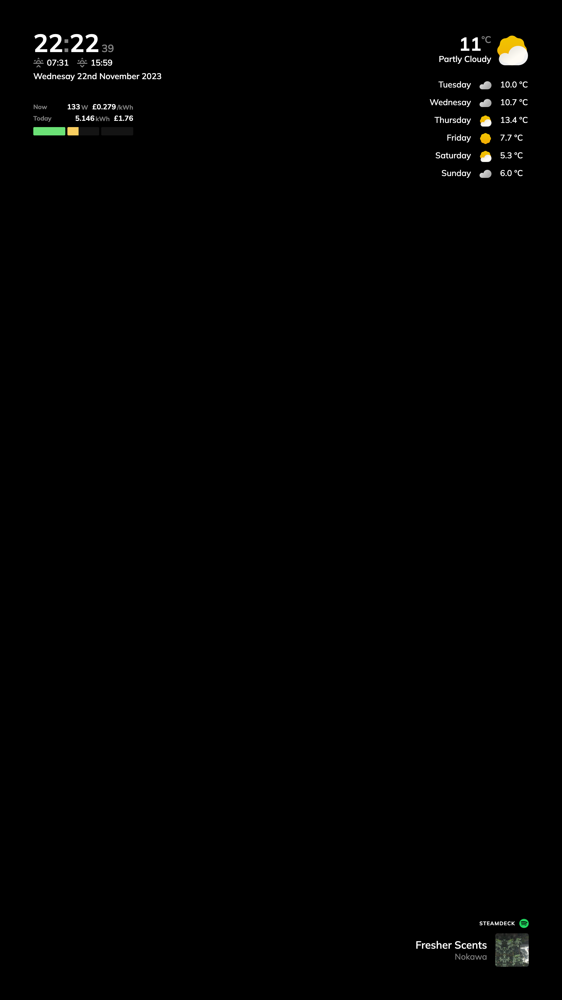

# Reflective

A custom Magic Mirror project which primarily depends on Home Assistant. Designed to run on a Raspberry Pi 3B+ or above with a 23" 1080p monitor in portrait mode.

This project is in active development. I will update this README as I make progress.

Although this project is for personal use, I am making it public in case anyone else finds it useful. Feel free to use any of the code in this project for your own purposes. However, if you write a cool blog post or make a cool video about it, I'd appreciate a link back to this repo.

I am aware of the MagicMirror2 project and although it is very cool, I wanted to build my own from scratch for the learning experience.

### Screenshot
